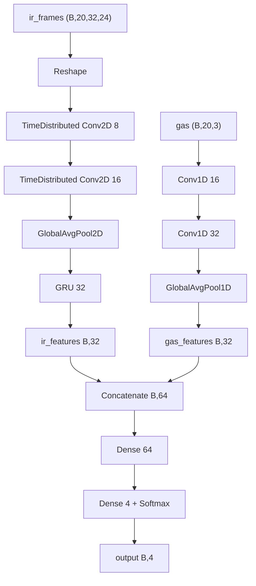

# MLX90640 Multi-Sensor Gas Detection System

Sensor fusion system for detecting and classifying gas emissions using thermal imaging and gas sensors. This project combines IR thermal data from the MLX90640 sensor with gas concentration measurements to train a machine learning model capable of distinguishing between normal air, aerosol, flame, and breath conditions.

## Project Overview

This project is divided into three main components:

1. **Data Extraction** - Python scripts for sensor data collection and dataset generation
2. **Model Training** - Machine learning model development and training
3. **Gas Detector Application** - Real-time inference application in C++

```
MLX90640 Multi-Sensor Gas Detection
├── Data Collection (Python)
├── Model Training (TensorFlow/TFLite)
└── Real-time Inference (C++)
```

---

## Hardware Setup

### Components

- **Raspberry Pi 5**
- **MLX90640** - 32×24 infrared thermal sensor (I2C interface)
- **MCP3008** - 8-channel ADC (SPI interface)
- **MQ2 Gas Sensor** - Detects LPG, propane, methane
- **MQ7 Gas Sensor** - Detects carbon monoxide
- **MQ135 Gas Sensor** - Detects various air pollutants

### Wiring Configuration

#### I2C Pins (MLX90640 to Raspberry Pi 5)

| MLX90640 Pin | RPi Pin | Description |
|--------------|---------|-------------|
| Vin | Pin 1 | 3.3V Power |
| GND | Pin 6 | Ground |
| SDA | Pin 3 | I2C Data (GPIO2) |
| SCL | Pin 5 | I2C Clock (GPIO3) |
| PS | Pin 9 | Ground (PowerDown Mode) |

#### SPI Pins (MCP3008 to Raspberry Pi 5)

| MCP3008 Pin | RPi Pin | Description |
|-------------|---------|-------------|
| CLK | Pin 11 | SPI Clock (GPIO17) |
| DOUT | Pin 10 | SPI MISO (GPIO9) |
| DIN | Pin 9 | SPI MOSI (GPIO10) |
| CS | Pin 24 | SPI Chip Select (GPIO8) |

#### ADC Channels (MCP3008)

| Gas Sensor | MCP3008 Channel | Description |
|-----------|-----------------|-------------|
| MQ2 | Channel 1 | LPG, Propane, Methane |
| MQ135 | Channel 2 | Air Quality |
| MQ7 | Channel 3 | Carbon Monoxide |

---

## Data Extraction & Collection

The data extraction module collects synchronised thermal and gas sensor data for training.

### Data Collection Process

#### 1. Sensor Initialisation

```python
from MLX90640_sensor import MLX90640
from MQgas_sensors import MQSensor
from MCP3008 import MCP3008

# Initialise I2C thermal sensor
ir_sensor = MLX90640(fps=4)  # 4 frames per second

# Initialise SPI ADC
adc = MCP3008(device="/dev/spidev0.0")

# Initialise gas sensors
gas_sensor = MQSensor(adc, channels={
    'MQ2': 1,    # Channel 1
    'MQ135': 2,  # Channel 2
    'MQ7': 3     # Channel 3
})
```

#### 2. Sample Data Collection

Each data sample consists of:
- **IR Thermal Data**: 32×24 pixel frame array from MLX90640
- **Gas Sensor Data**: Analog readings from MQ2, MQ135, MQ7
- **Timestamp**: Unix timestamp of collection
- **Label**: Class label (normal, aerosol, flame, breath)

```python
# Collect 5-second window @ 4 FPS = 20 frames
ir_frames = ir_sensor.getIrData(num_frames=20)  # Shape: (20, 32, 24)
gas_readings = gas_sensor.getGasData(duration=5, fps=4)  # Shape: (20, 3)

```

#### 3. Dataset Organisation

Run `generate_sample.py` to create datasets:

```bash
cd data-extraction/
python generate_sample.py --class normal --samples 100 --output dataset/normal/
python generate_sample.py --class aerosol --samples 100 --output dataset/aerosol/
python generate_sample.py --class flame --samples 100 --output dataset/flame/
python generate_sample.py --class breath --samples 100 --output dataset/breath/
```

#### 4. NPZ File Validation

Validate collected data with:

```bash
python check_npz_file.py dataset/normal/sample_001.npz
```

### Data Format Specifications

- **NPZ Archive** containing:
  - `ir_data`: float32 array of shape (N_frames, 32, 24)
  - `gas_data`: float32 array of shape (N_frames, 3)
  - `label`: string or integer class label
  - `timestamp`: Unix timestamp of collection

---

## Model Architecure (Sensor Fusion)

Model trained using model-training/gas_detector_model.ipynb



### Model Files

- `model_float32.tflite` - Full precision model (larger, more accurate)
- `model_float16.tflite` - Half precision model (smaller, faster)
- `norm_stats.npz` - Normalisation statistics (mean, std dev)

---

## Gas Detector Application (C++)

Real-time inference engine implemented in C++ for efficient inference on Raspberry Pi 5.

### Application Architecture

```
Gas Detector Application
├── Sensor Readers
│   ├── MLX90640 (IR Thermal)
│   ├── MQSensor (Gas Sensors)
│   └── MCP3008 (ADC Interface)
├── Window Queue
│   └── Thread-safe data buffering
└── Inference Engine
    └── TFLite Interpreter

```

### Building the Application

```bash
cd gas-detector/app
make clean
make
```

### Running the Application

```bash
cd gas-detector/app
./gas_detector
```

Output example:
```
┌─────────────────────────────┐
│ Prediction: normal (95.3%)  │
├─────────────────────────────┤
│ normal       95.3%          |
│ aerosol      3.2%           |
│ flame        1.2%           |
│ breath       0.3%           |
└─────────────────────────────┘
```

## Installation & Setup

### Prerequisites

- Raspberry Pi 5 with Raspberry Pi OS (64-bit recommended)
- Python 3.8+
- C++17 compatible compiler (g++)
- I2C and SPI interfaces enabled

### Step 1: Enable I2C and SPI

```bash
sudo raspi-config
# Navigate to: Interface Options → I2C → Enable
# Navigate to: Interface Options → SPI → Enable
```

### Step 2: Install Python Dependencies

```bash
pip install -r requirements.txt
```

### Step 3: Build TensorFlow Lite

If not already available:

```bash
bash tensorflow_setup.sh
# This script compiles TensorFlow Lite for ARM64
```

### Step 4: Compile Gas Detector Application

```bash
cd gas-detector/app
make
```

---

## Usage Workflow

### Complete Data-to-Deployment Pipeline

#### Phase 1: Data Collection

```bash
# 1. Collect normal air samples
cd data-extraction/
python generate_sample.py --class normal --samples 100

# 2. Collect aerosol samples
python generate_sample.py --class aerosol --samples 100

# 3. Collect flame samples
python generate_sample.py --class flame --samples 100

# 4. Collect breath samples
python generate_sample.py --class breath --samples 100

# 5. Validate collected data
python check_npz_file.py dataset/normal/sample_001.npz
```

#### Phase 2: Model Training

Open gas_detector_model.ipynb in google collab and upload dataset to google drive. Run all cells and obtain tflite model.

#### Phase 3: Deployment & Inference

```bash
# Copy models to deployment directory
cp python-inference/model_float32.tflite gas-detector/app/

# Build C++ application
cd gas-detector/app
make

# Run inference
./gas_detector
```

---

## Performance Metrics

### Recommended System Specifications

- **Inference Latency**: < 200ms per window (on RPi5)
- **Throughput**: ~5 predictions per second
- **Memory Usage**: 
- **Model Size**: ~128 KB (float32)

## Troubleshooting

### I2C Connection Issues
```bash
# Check I2C devices
i2cdetect -y 1

# Expected output shows MLX90640 at address 0x33
```

### SPI Connection Issues
```bash
# Verify SPI is enabled
ls -la /dev/spidev*

# Should show /dev/spidev0.0 and /dev/spidev0.1
```

### Model Loading Errors
```bash
# Ensure model path is correct
# Check model file exists and is readable
file python-inference/model_float32.tflite
```

### Compilation Errors
```bash
# Ensure all dependencies are installed
# Check TensorFlow Lite library path in Makefile
# Verify C++17 support: g++ --version
```

---

## Project References

- [MLX90640 Datasheet](https://www.melexis.com/en/documents/documentation/datasheets/datasheet-mlx90640)
- [MCP3008 Datasheet](https://www.microchip.com/en-us/product/MCP3008)
- [TensorFlow Lite](https://www.tensorflow.org/lite)
- [Raspberry Pi 5](https://www.raspberrypi.com/products/raspberry-pi-5/)

---
