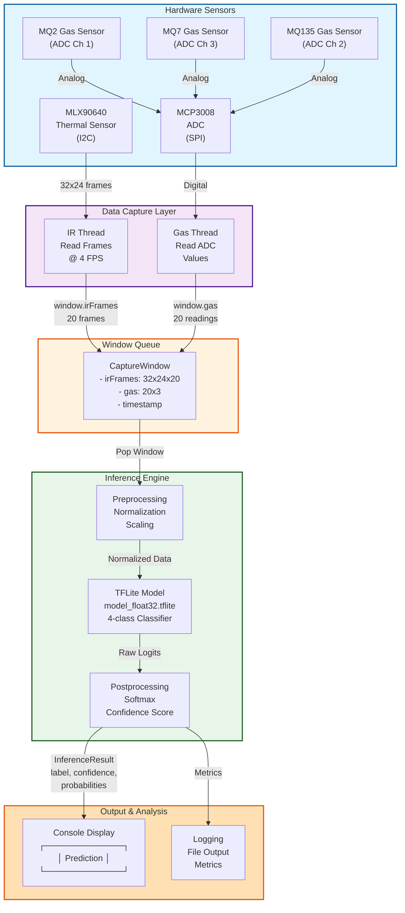

# Gas Detector Application (C++)

Real-time inference engine implemented in C++ for efficient inference on Raspberry Pi 5.

### Application Architecture



### Building the Application

```bash
cd gas-detector/app
make clean
make
```

### Running the Application

```bash
cd gas-detector/app
./gas_detector
```

Output example:
```
┌─────────────────────────────┐
│ Prediction: normal (95.3%)  │
├─────────────────────────────┤
│ normal       95.3%          |
│ aerosol      3.2%           |
│ flame        1.2%           |
│ breath       0.3%           |
└─────────────────────────────┘
```

### Key Application Components

#### 1. Capture Thread
- Reads IR frames from MLX90640 (4 FPS)
- Reads gas sensor values from MCP3008
- Buffers synchronised data in WindowQueue
- Configuration: 5-second windows (20 frames + 20 gas readings)

#### 2. Inference Thread
- Retrieves data windows from queue
- Runs TFLite model inference
- Outputs predictions and confidence scores
- Handles 4 classes: normal, aerosol, flame, breath

#### 3. Window Queue
- Thread-safe producer-consumer pattern
- Capacity: 2 windows
- Condition variables for synchronisation
- Prevents data loss during processing

### Dependencies

- **TensorFlow Lite** - Inference framework
- **Abseil-cpp** - Dependency of TFLite
- **Ruy** - Matrix operations library
- **XNNPACK** - CPU acceleration delegate
- **pthreadpool** - Thread pool implementation

---
