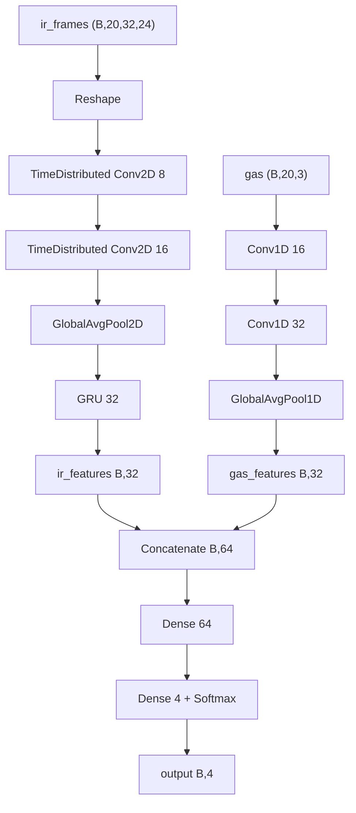

# Gas Detector - Model Architecure & Training

A multimodal deep learning classifier that fuses thermal infrared (IR) and gas sensor data to detect four environmental classes in real time on a Raspberry Pi 5.

## Classes

| Index | Label | Description |
|---|---|---|
| 0 | `normal` | Baseline ambient air |
| 1 | `aerosol` | Aerosol spray present |
| 2 | `flame` | Open flame present |
| 3 | `breath` | Human breath |

## Inputs

| Input | Shape | Description |
|---|---|---|
| `ir_frames` | `(batch, 20, 32, 24)` | 20-frame thermal IR sequence from MLX90640 |
| `gas` | `(batch, 20, 3)` | 20-sample time series from 3 MQ gas sensors |

**Gas sensor channels:**

| Channel | Sensor | Targets |
|---|---|---|
| 0 | MQ-2 | Combustible gases (LPG, propane, hydrogen) |
| 1 | MQ-7 | Carbon monoxide (CO) |
| 2 | MQ-135 | Air quality (NH₃, NOₓ, benzene, CO₂) |

**Capture settings:** 5 seconds at 4 Hz → 20 samples per window. IR and gas are captured in parallel threads.

## Model Architecture (Sensor Fusion)



## Model Training

The model was trained on Google Colab

### Dataset

Samples were collected on a Raspberry Pi 5 using `generate_sample.py`, which captures a synchronised 5-second window of IR frames and gas readings per labelled class. Each sample is saved as a `.npz` file:

| Field | Shape | Description |
|---|---|---|
| `ir_frames` | `(20, 32, 24)` | Thermal IR frame sequence |
| `gas` | `(20, 3)` | Gas sensor readings in PPM |


---

### Normalisation

Z-score normalisation is computed on the **training split only** and applied to both train and validation sets. Stats are never computed on validation data to prevent leakage.

```
ir_norm  = (ir_frames − ir_mean) / ir_std    # ir_mean/std: (1, 1, 32, 24)
gas_norm = (gas − gas_mean)       / gas_std   # gas_mean/std: (1, 1, 3)
```

The final normalisation stats (computed over the full dataset) are saved to `norm_stats.npz` for use at inference time.

---

### Data Augmentation

Each training sample is augmented **3× during cross-validation** and **4× for the final model**, applied after normalisation. Augmentations are applied independently per sample:

| Augmentation | Probability | Detail |
|---|---|---|
| Gaussian noise (IR) | 70% | `σ = 0.05` added to IR frames |
| Gaussian noise (gas) | 70% | `σ = 0.03` added to gas readings |
| Horizontal IR flip | 50% | Flips the width axis of all 20 frames |
| Temporal jitter | 50% | Shifts sequence by ±1 timestep with zero-padding |
| Gas amplitude scale | 60% | Multiplies all gas channels by `U(0.9, 1.1)` |
| IR frame dropout | 50% | Replaces 1–2 random frames with the sequence mean |

---

### Cross-Validation

Training uses **5-fold stratified cross-validation** to evaluate generalisation before fitting the final model.

```
For each fold:
  1. Split → train (80%) / val (20%), stratified by class
  2. Compute norm stats on train split only
  3. Augment training data 3× → ~4× original train size
  4. Train fresh model from scratch
  5. Save best checkpoint (monitored: val_accuracy)
  6. Collect out-of-fold (OOF) predictions on val split
```

Out-of-fold predictions are aggregated across all folds to compute an unbiased ensemble accuracy over the full dataset.

---

### Training Configuration

| Hyperparameter | Value |
|---|---|
| Optimiser | Adam |
| Learning rate | `1e-3` |
| Loss | Sparse categorical cross-entropy |
| Batch size | 32 |
| Max epochs (CV) | 150 with early stopping |
| Early stopping patience | 25 epochs (monitors `val_accuracy`) |
| LR reduction | ×0.5 if `val_loss` plateaus for 12 epochs, min `1e-6` |
| L2 regularisation | `λ = 1e-4` on all Conv and Dense kernels |
| GRU implementation | CuDNN (training) → `RNN(GRUCell, unroll=True)` (export) |

---

### Final Model

After cross-validation, a final model is trained on the **full dataset** (all classes, all samples) with augmentation:

```
Final epochs = floor(mean(CV best epochs) × 1.2)
```

The epoch count is derived from CV results rather than a fixed value — using the average best epoch across folds with a 20% buffer to account for the larger training set. No validation split is used; the checkpoint monitors training `accuracy`.

The saved checkpoint (`checkpoints/final_model.keras`) is then exported to TFLite for deployment.

---

### Export

The GRU layer is swapped for `RNN(GRUCell, unroll=True)` at export time to produce a fully static computation graph. Weights are transferred with `set_weights()` — no retraining required.

| File | Precision | Size |
|---|---|---|
| `model_float32.tflite` | float32 | ~128 KB |
| `model_float16.tflite` | float16 weights | ~109 KB |

## Export & Deployment

The model is exported in two quantised formats for deployment on the Pi 5:

| File | Size | Precision | Use case |
|---|---|---|---|
| `model_float32.tflite` | ~128 KB | float32 | Reference / debugging |
| `model_float16.tflite` | ~109 KB | float16 weights | **Recommended for Pi 5** |

The GRU layer is replaced at export time with `RNN(GRUCell, unroll=True)` to produce a fully static computation graph compatible with pure `TFLITE_BUILTINS` so no Flex ops or special runtime dependencies required.

Weights are transferred from the trained model using `set_weights()` before export — no retraining needed.

---

